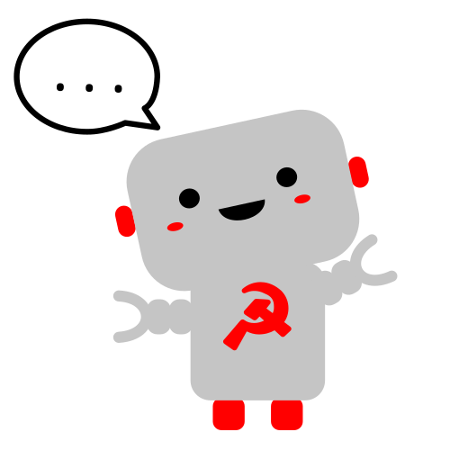
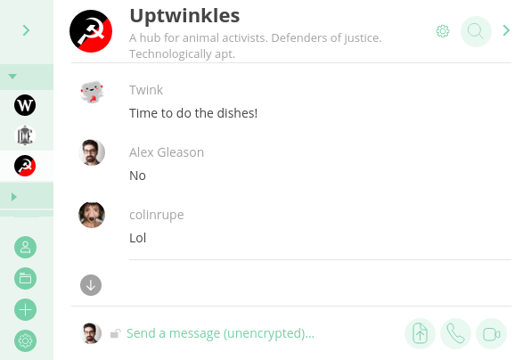

# Twink

Twink is a Matrix chatbot created for Uptwinkles to help us keep on top of our chores and automate other house tasks.

Twink is a work in progress and is constantly improving as we build the culture at Uptwinkles. He's written in Node.js and uses node-schedule to send chat messages at certain times of the day.

## License

Twink is licensed under GNU GPL version 3.0. For the full license see the LICENSE file.
